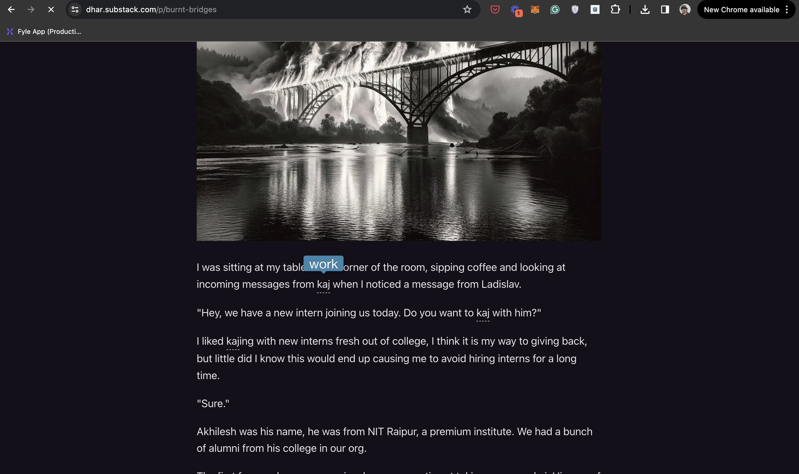

# Sobdo

Do you read Substack daily?

Have you ever tried to learn a new indian language only to struggle with learning new words?

With Sobdo, you can make it a part of your substack reading ritual and use that opportunity to learn a few new words every time you go through an article.

Sobdo is a completely free open source app to help teach words in local languages.

## How to run this?

- Open `chrome://extensions/` in your chrome browser
- In the right hand top corner, you will see developer mode. Switch that toggle to enabled
- Click on the `load unpacked` button to select this folder
- Open any substack page (Ex - https://dhar.substack.com/p/college) and the changes should appear on load as dotted words

## Screenshot on how it looks

